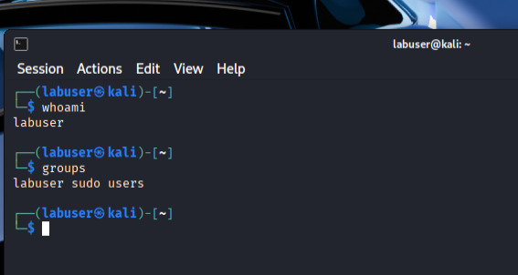
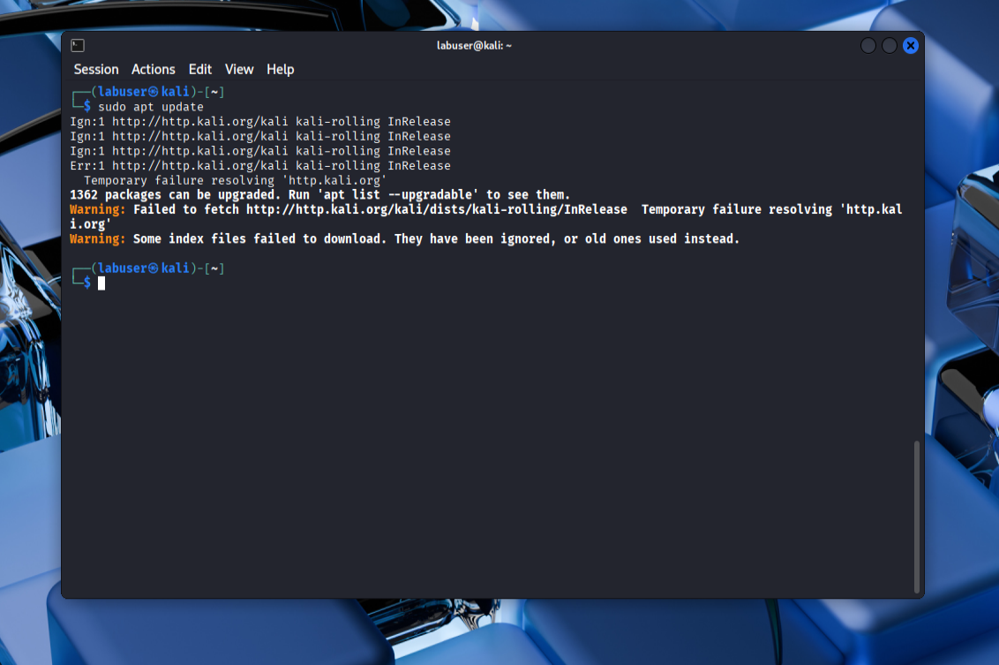
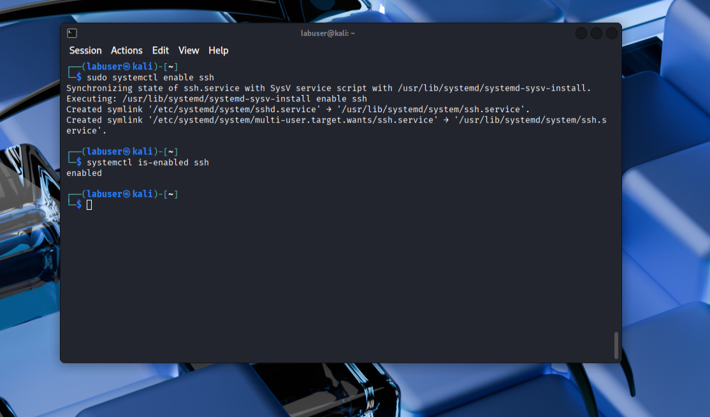

# Linux Security Fundamentals Lab

## Overview
This lab demonstrates foundational Linux security hardening practices, including user privilege management, SSH configuration, and service validation.

## Environment
- OS: Kali Linux (Rolling)
- Hypervisor: Oracle VirtualBox
- User Accounts: Non-root user with sudo access

## Objectives
- Enforce least privilege access
- Configure and secure SSH access
- Validate service behavior and logging
- Document security-focused system changes

## User & Permission Management
A non-root user was created and granted sudo privileges to enforce the principle of least privilege while still allowing administrative actions when required.

Sudo access was validated by executing privileged commands as the non-root user. Although the command executed successfully, package updates failed due to a temporary DNS/network resolution issue within the virtual machine. This confirmed that the failure was related to connectivity rather than insufficient privileges.

## SSH Service Management
The SSH service was installed but inactive by default, reflecting a secure baseline. The service was manually started and enabled to allow controlled remote administration and persistence after system reboots.

## SSH Hardening
Brief explanation + screenshots 06–08

## Logging & Validation
SSH logs were reviewed to confirm service activity and validate configuration changes.

## Troubleshooting & Lessons Learned
(bullets above)

## Skills Demonstrated
- Linux system administration
- SSH hardening and access control
- Service management with systemd
- Security-focused troubleshooting
