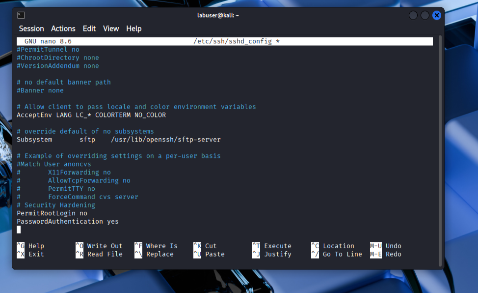
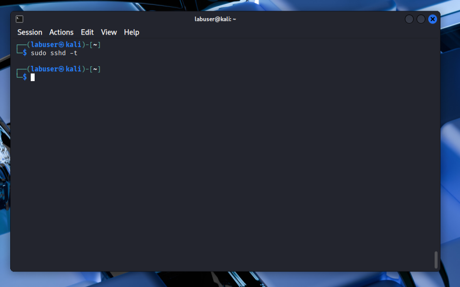
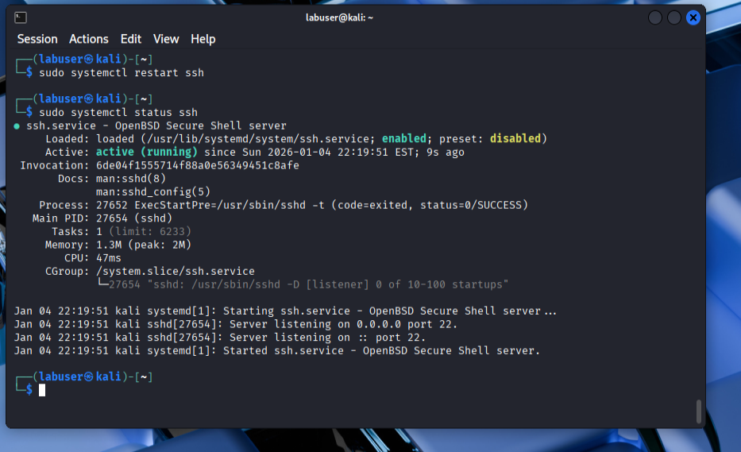
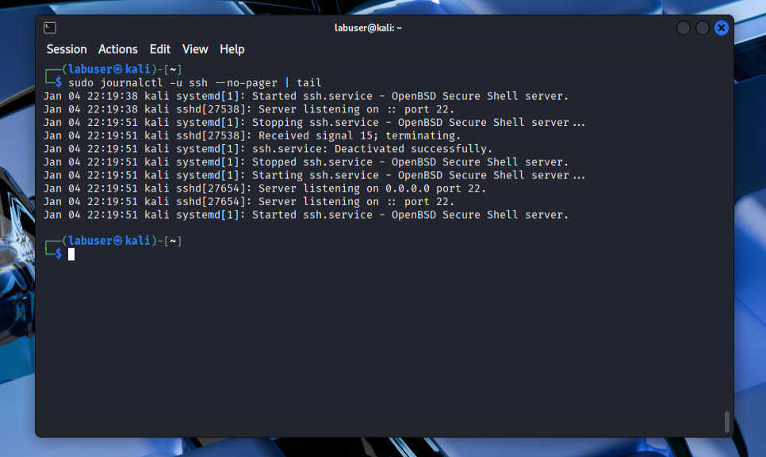

# Linux Security Fundamentals Lab

## Overview
This lab demonstrates foundational Linux security hardening practices, including user privilege management, SSH configuration, and service validation.

## Environment
- OS: Kali Linux (Rolling)
- Hypervisor: Oracle VirtualBox
- User Accounts: Non-root user with sudo access

## Objectives
- Enforce least privilege access
- Configure and secure SSH access
- Validate service behavior and logging
- Document security-focused system changes

## User & Permission Management
A non-root user was created and granted sudo privileges to enforce the principle of least privilege while still allowing administrative actions when required.

Sudo access was validated by executing privileged commands as the non-root user. Although the command executed successfully, package updates failed due to a temporary DNS/network resolution issue within the virtual machine. This confirmed that the failure was related to connectivity rather than insufficient privileges.

## SSH Service Management
The SSH service was installed but inactive by default, reflecting a secure baseline. The service was manually started and enabled to allow controlled remote administration and persistence after system reboots.

## SSH Hardening
SSH access was hardened by explicitly disabling root login and defining authentication behavior. These settings were added manually to ensure security controls were explicitly enforced rather than relying on default configurations.

## Configuration Validation
Configuration changes were validated prior to restarting the SSH service to reduce the risk of misconfiguration and accidental lockouts.

## Post-Hardening Verification
After applying the hardened configuration, the SSH service was restarted and verified to be running normally, confirming that the security changes did not disrupt service availability.

## Logging & Validation
SSH logs were reviewed to confirm service activity and validate configuration changes.

## Troubleshooting & Lessons Learned
- Verified that successful sudo execution does not guarantee network connectivity, reinforcing the importance of separating privilege issues from DNS or network failures.
- Learned that services may be installed but disabled by default, requiring explicit enablement for persistence across reboots.
- Reinforced the importance of validating SSH configurations before restarting services to prevent accidental lockouts.
- Applied the principle of least privilege by restricting root SSH access while maintaining controlled administrative capabilities.

## Skills Demonstrated
- Linux system administration
- SSH service configuration and hardening
- Privilege and access control
- Security-focused troubleshooting
- Documentation of technical changes

